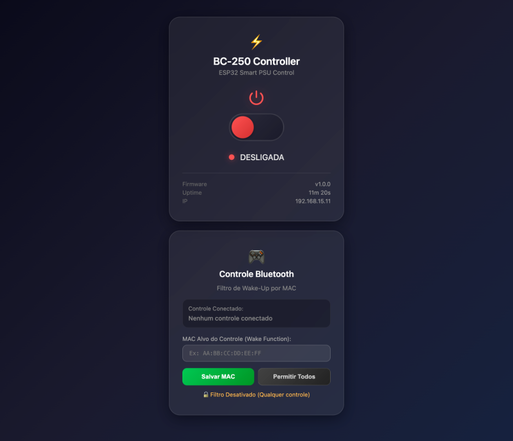
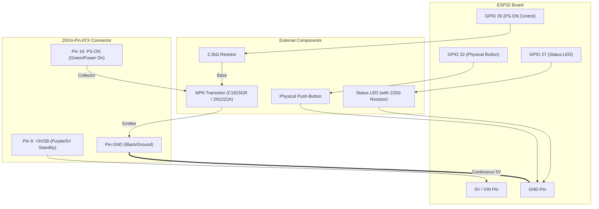

# ESP32-BC-250 — Smart ATX Power Supply Controller

[Versão em Português](README_PTBR.md)

---

## 📋 About the Project
**ESP32-BC-250** is a comprehensive, high-performance firmware written in C++ (Arduino Framework via PlatformIO) designed to transform a BC-250 model ATX power supply (or any standard ATX PSU) into a modern, connected, smart controller.

The system merges four independent control methods into a single **non-blocking** state machine focused on stability, low latency, and boot safety:
1. **🔘 Physical Button:** Hardware interrupt (ISR FALLING) with software debounce and cooldown protection (500ms).
2. **🌐 Responsive Web UI:** Embedded asynchronous HTTP server (`ESPAsyncWebServer`) serving a sleek, Dark-Mode web panel with real-time AJAX/JSON status updates.
3. **🗣️ Voice Control (Alexa):** Local smart home device emulation (`FauxmoESP`) fully compatible with Amazon Echo devices (e.g., *"Alexa, turn on BC-250"*).
4. **🎮 Bluetooth Gamepads:** Native support for modern controllers (PS5 DualSense, PS4 DualShock, Xbox Wireless, 8BitDo, Nintendo Switch Pro) powered by the `Bluepad32` library, featuring custom MAC Address filtering stored in NVS/Preferences via Web Panel.

### 🖼️ Responsive Web Interface (Dark Mode)


---

## 🔌 ATX Connection Diagram & Pinout

To power the ESP32 and control the ATX power supply, only **3 essential pins from the main 20/24-pin ATX connector** are used:
- **+5VSB (5V Standby - Pin 9 / Purple):** Provides continuous 5V power even when the main PSU outputs are OFF. Powers the ESP32 via the `5V / VIN` pin.
- **PS-ON (Power Supply On - Pin 16 / Green):** The main PSU activation pin. When grounded (pulled LOW), the power supply turns ON all main rails (+12V, +5V, +3.3V).
- **GND (Ground - Pins 3, 5, 7, 15, 17, 18, 19, or 24 / Black):** Common ground shared between the PSU, ESP32, NPN transistor, and push-button.

### 📊 Hardware Wiring Table

| Component / ESP32 Pin | Mode | Circuit Wiring / 24-Pin ATX Connector | Initial State (Boot) |
|---|---|---|---|
| **5V / VIN Pin (ESP32)** | `POWER` | Connected directly to **Pin 9 (+5VSB / Purple)** on ATX connector | Always Powered |
| **GND Pin (ESP32)** | `POWER` | Connected to **GND (Black)** on ATX connector | Common Ground |
| **GPIO 26 (ESP32)** | `OUTPUT` | Connected to the **Base** of an NPN Transistor (C1815GR or 2N2222A) via a 2.2kΩ Resistor | `LOW` (PSU OFF) |
| **Transistor Collector** | — | Connected to **Pin 16 (PS-ON / Green)** on ATX connector | — |
| **Transistor Emitter** | — | Connected to **GND (Black)** on ATX connector | — |
| **GPIO 27 (ESP32)** | `OUTPUT` | Connected to Anode of **Status LED** (via 220Ω resistor). Cathode to GND | `LOW` (OFF) |
| **GPIO 32 (ESP32)** | `INPUT_PULLUP` | Connected to one terminal of the **Physical Push-Button**. Other terminal to GND | Internal Pull-up |
| **GPIO 34 (ESP32)** | `INPUT` | Optional logic input (0 to 3.3V) for reading signals like **Power Good** (PG). Requires `#define USE_LOGIC_INPUT`. | ADC Read |

### 🧬 Circuit Schematic (Mermaid Diagram)



---

## 🧠 Firmware Architecture

- **Single Source of Truth:** PSU state is centrally managed by `psuState` inside `psu_control.h`. All control sources trigger `setPSUState(bool newState, const char* source)`.
- **Non-Blocking Execution:** Zero `delay()` calls inside `loop()`. Tasks are handled asynchronously using timers and callbacks.
- **Wi-Fi & Bluetooth Coexistence:** Bluepad32 BTstack inquiry is paused during Wi-Fi onboarding to guarantee captive portal stability (`WiFiManager`).
- **HTTP Port Sharing:** `ESPAsyncWebServer` and `FauxmoESP` cleanly share TCP Port 80 without socket binding conflicts.

---

## 🚀 Build and Flash Guide (PlatformIO)

### Prerequisites
- Visual Studio Code with **PlatformIO IDE** extension (or PlatformIO CLI).

### Instructions
1. Clone this repository:
   ```bash
   git clone https://github.com/your-username/ESP32-BC-250.git
   cd ESP32-BC-250
   ```
2. Build project firmware:
   ```bash
   pio run
   ```
3. Flash to ESP32:
   ```bash
   pio run --target upload
   ```
4. Monitor Serial output (115200 baud):
   ```bash
   pio device monitor
   ```

---

## ⚙️ Initial Setup (Wi-Fi & Alexa)

1. **Wi-Fi Onboarding:** On first boot, the ESP32 spawns a captive AP named `ESP32-BC250-Setup`. Connect via phone or PC to enter your local Wi-Fi credentials.
2. **Alexa Pairing:** Ensure your Amazon Echo device is on the same local Wi-Fi network. Say: *"Alexa, discover devices"*. Alexa will discover a new smart device named **`BC-250`**.
3. **Bluetooth Gamepad:** Put your gamepad into pairing mode. Bluepad32 will connect automatically, and pressing the **PS/Home** button will toggle power.

---

## 📜 License & Credits

Developed with ❤️ by **ESP32-BC-250 Project**.
Based on reference architectures by [dexikdex](https://github.com/dexikdex/ESP32-BC250-LOP_PSU-PowerON-Xbox) and [PetteriLah](https://github.com/PetteriLah/BC-250-PC-Remote-Control).
