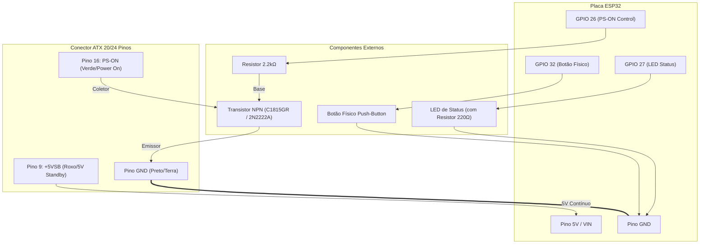

# ESP32-BC-250 — Controlador Inteligente para Fonte ATX

[English Version](README.md)

---

## 📋 Sobre o Projeto
O **ESP32-BC-250** é um firmware completo e de alta performance escrito em C++ (Arduino Framework via PlatformIO) para transformar uma fonte ATX modelo BC-250 (ou qualquer fonte ATX padrão) em um sistema inteligente e conectado.

O projeto unifica quatro métodos independentes de controle em uma máquina de estados **non-blocking** com foco em estabilidade, baixa latência e segurança de boot:
1. **🔘 Botão Físico:** Interrupção via hardware (ISR FALLING) com trava de debounce/cooldown por software (500ms).
2. **🌐 Interface Web Responsiva:** Servidor HTTP assíncrono embarcado (`ESPAsyncWebServer`) servindo um painel Dark Mode moderno com controle por toggle e atualização de status em tempo real (via AJAX/JSON).
3. **🗣️ Comando de Voz (Alexa):** Emulação local de dispositivo smart home (`FauxmoESP`) compatível com caixas Amazon Echo (ex: *"Alexa, ligar BC-250"*).
4. **🎮 Controles Bluetooth:** Suporte nativo a controles modernos (PS5 DualSense, PS4 DualShock, Xbox Wireless, 8BitDo, Nintendo Switch Pro) via biblioteca `Bluepad32`, com filtro personalizável por MAC Address gravado na NVS/Preferences via Painel Web.

### 🖼️ Interface Web Responsiva (Dark Mode)


---

## 🔌 Diagrama de Conexão e Pinagem ATX

Para alimentar o ESP32 e controlar a fonte ATX, utilizam-se apenas **3 pinos essenciais do conector principal de 20/24 pinos da fonte**:
- **+5VSB (5V Standby - Pino 9 / Roxo):** Fornece 5V contínuos mesmo com a fonte em standby (desligada). Alimenta o pino `5V / VIN` do ESP32.
- **PS-ON (Power Supply On - Pino 16 / Verde):** Pino de acionamento da fonte. Quando aterrado (LOW), a fonte liga todas as suas saídas (+12V, +5V, +3.3V).
- **GND (Ground - Pinos 3, 5, 7, 15, 17, 18, 19 ou 24 / Preto):** Terra comum entre a fonte, ESP32, transistor NPN e botão físico.

### 📊 Tabela de Conexão de Hardware

| Componente / Pino ESP32 | Modo | Ligação no Circuito / Conector ATX 24 Pinos | Estado Inicial (Boot) |
|---|---|---|---|
| **Pino 5V / VIN (ESP32)** | `POWER` | Conectado diretamente ao **Pino 9 (+5VSB / Roxo)** do conector ATX da fonte | Alimentado sempre |
| **Pino GND (ESP32)** | `POWER` | Conectado ao **GND (Preto)** do conector ATX da fonte | Terra Comum |
| **GPIO 26 (ESP32)** | `OUTPUT` | Conectado à **Base** de um Transistor NPN (C1815GR ou 2N2222A) via Resistor de 2.2kΩ | `LOW` (Fonte Desligada) |
| **Transistor Coletor** | — | Conectado ao **Pino 16 (PS-ON / Verde)** do conector ATX da fonte | — |
| **Transistor Emissor** | — | Conectado ao **GND (Preto)** do conector ATX da fonte | — |
| **GPIO 27 (ESP32)** | `OUTPUT` | Conectado ao Anodo do **LED de Status** do botão (via resistor 220Ω). Catodo no GND | `LOW` (Apagado) |
| **GPIO 32 (ESP32)** | `INPUT_PULLUP` | Conectado a um terminal do **Botão Físico (Push-button)**. O outro terminal vai no GND | Pull-up Interno |
| **GPIO 34 (ESP32)** | `INPUT` | Entrada lógica opcional (0 a 3.3V) para leitura de sinais como **Power Good** (PG). Requer `#define USE_LOGIC_INPUT`. | Leitura ADC |

### 🧬 Esquema do Circuito (Diagrama Mermaid)



---

## 🧠 Arquitetura do Firmware

- **Single Source of Truth:** O estado da fonte é mantido estritamente na variável `psuState` em `psu_control.h`. Qualquer método de controle aciona a função central `setPSUState(bool newState, const char* source)`.
- **Zero Delays Bloqueantes:** Todo o ciclo do `loop()` é non-blocking, permitindo a execução paralela de tarefas de rede, Bluetooth e leitura de entradas.
- **Coexistência Wi-Fi + Bluetooth:** O framework customizado do Bluepad32 utiliza BTstack. A varredura Bluetooth é temporariamente pausada durante o provisionamento da rede Wi-Fi para garantir estabilidade no portal cativo (`WiFiManager`).
- **Compartilhamento de Porta HTTP:** O `ESPAsyncWebServer` e o `FauxmoESP` compartilham a porta 80 de forma limpa sem conflitos de socket.

---

## 🚀 Como Compilar e Gravar (PlatformIO)

### Pré-requisitos
- Visual Studio Code com a extensão **PlatformIO IDE** instalada (ou PlatformIO Core CLI).

### Passos
1. Clone este repositório:
   ```bash
   git clone https://github.com/seu-usuario/ESP32-BC-250.git
   cd ESP32-BC-250
   ```
2. Compile o projeto:
   ```bash
   pio run
   ```
3. Grave no ESP32 (conectado via USB):
   ```bash
   pio run --target upload
   ```
4. Abra o Monitor Serial para depuração (115200 baud):
   ```bash
   pio device monitor
   ```

---

## ⚙️ Configuração Inicial (Wi-Fi e Alexa)

1. **Provisionamento Wi-Fi:** No primeiro boot (ou se a rede salva não for encontrada), o ESP32 criará um Access Point com o SSID `ESP32-BC250-Setup`. Conecte-se a ele pelo celular/PC para configurar sua rede Wi-Fi local.
2. **Pareamento Alexa:** Certifique-se de que sua caixa Amazon Echo esteja na mesma rede local. Diga: *"Alexa, procurar dispositivos"*. A Alexa encontrará o dispositivo inteligente nomeado como **`BC-250`**.
3. **Conexão Gamepad BT:** Ao ligar o ESP32, coloque seu controle Bluetooth em modo de pareamento. O Bluepad32 conectará automaticamente e o botão **PS/Home** passará a alternar o estado da fonte.

---

## 📜 Licença e Créditos

Desenvolvido por **ESP32-BC-250 Project**.
Baseado nas arquiteturas de referência de [dexikdex](https://github.com/dexikdex/ESP32-BC250-LOP_PSU-PowerON-Xbox) e [PetteriLah](https://github.com/PetteriLah/BC-250-PC-Remote-Control).
